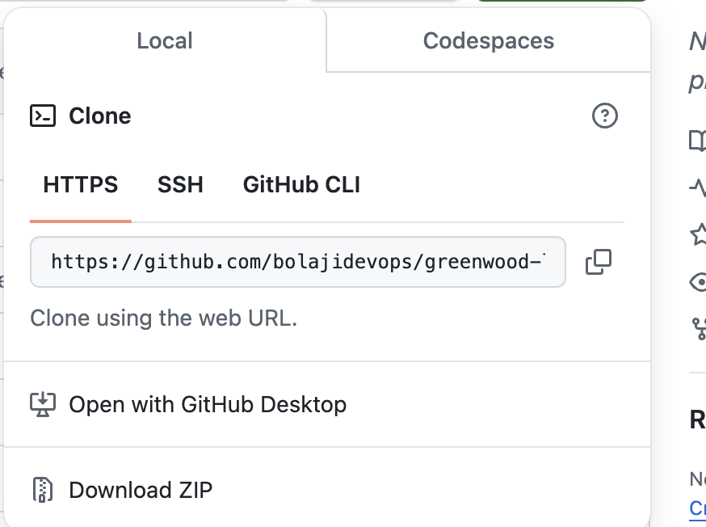

# CapStone Project: Enhancing a Community Library Website

## Introduction

Enhancing the website for the Greenwood Community Library which aims to be more engaging and informative for visitors. Which includes basic sections: Home, About Us, Events, and Contact Us.

### Scope of Work

My team will be in charge of adding a “Book Review” section and update the “Events” page to feature upcoming community events.
Morgan and Jamie will carry out the task. Morgan will handle the “Book Review” section, while Jamie will update the “Event” page with new Community events.

## Setup

* Creating a Repository on Github
* Naming it grrenwood-library-website
* Initializing it with a README.md file and cloning it to my local machine.

### See images below:

The images above shows the steps on how i created my repository and named it greenwood-library-website, also further to initializing it with a README.md file and lastly cloning it to my local machine.

### Task

In my main branch using the Visual Code Editor i created the following files for each of the web page needed for this project.

* home.html
* about_us.html
* events.html
* contact_us.html

I was able to achive the above files using the command "Vim" on my local terminal on Visual code editor.

See image representation below. 

After creating the above files, I proceeded to staging, adding and commiting. This will allow Git to be aware of the files created and the modifications made to them at any point in time.

The above images shows the staging, comitting and pushing process of the files to the github.

### Morgan's Task: Adding Book Reviews

A branch was created for morgan named "add-book-Reviews" and a new file called book_reviews.html was created to represent the book reviews section of the project.
This file (*book_reviews.html*) contains Morgan's codes in building the **Book Reviews** Section of the project.

The above images shows how the file (book_review.html) was created, stage and committed, Also it shows how the new  branch created for morgan named (add-book-review) was created and switched to from the default brach.